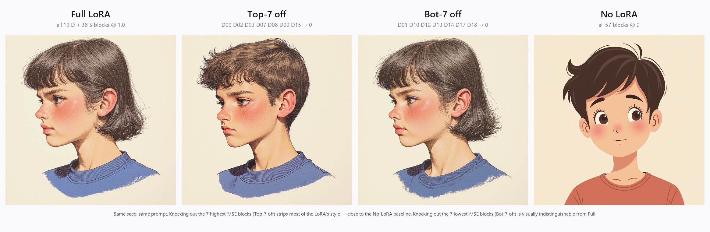
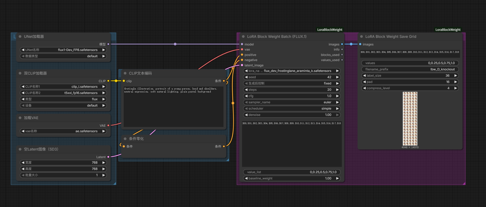
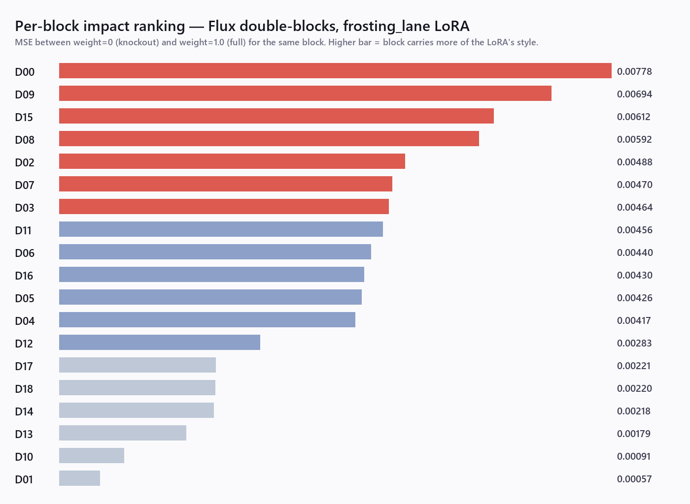
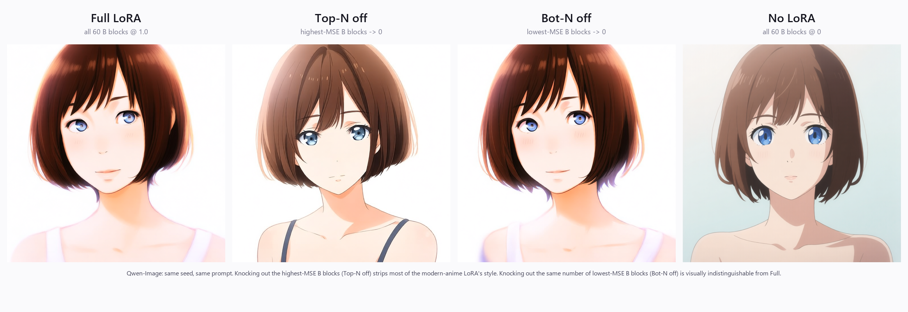
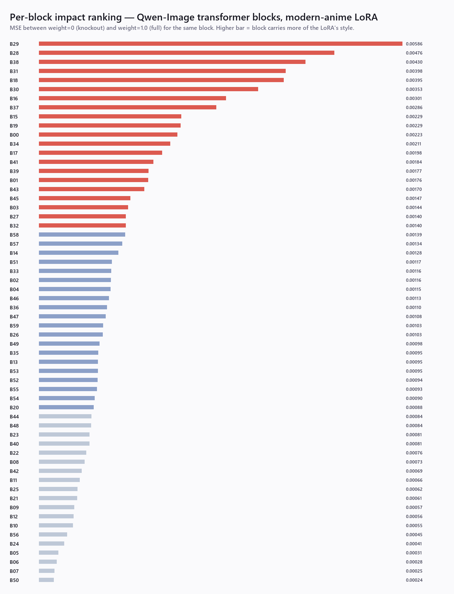
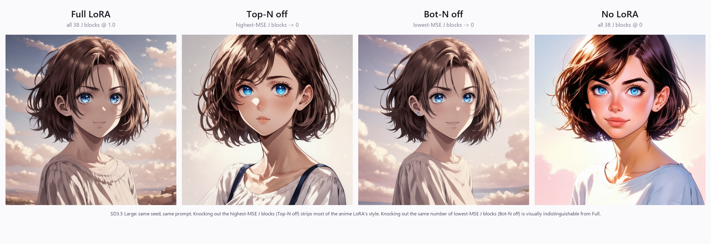
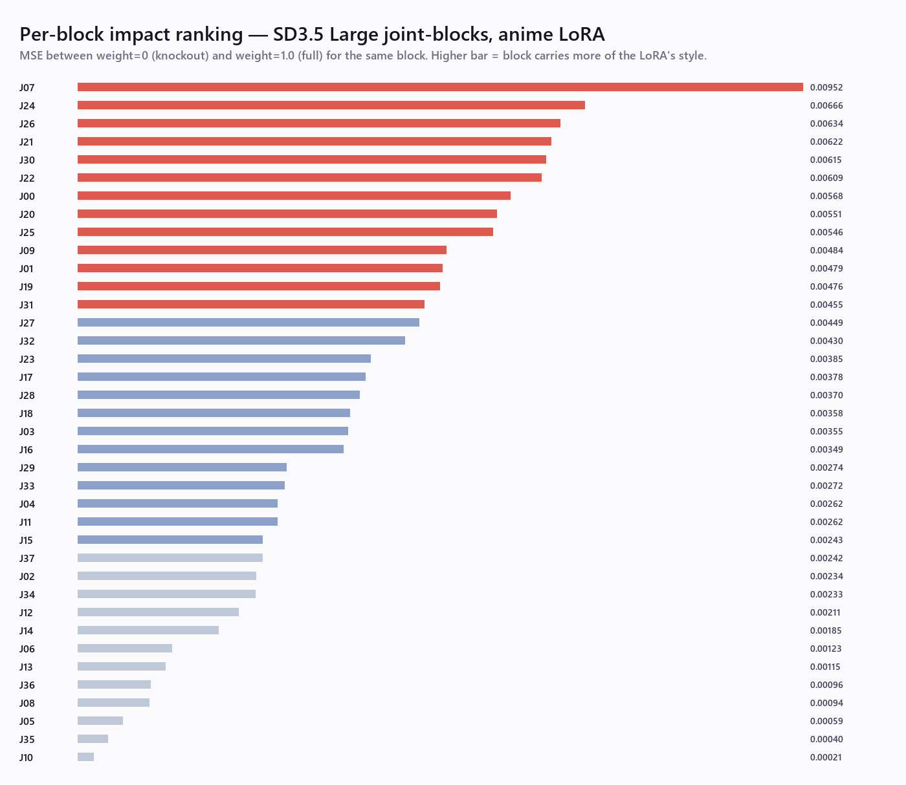

# ComfyUI-LoraBlockWeight

**English** | [简体中文](README.zh-CN.md)

[](LICENSE)
[](https://www.python.org/)
[](https://github.com/comfyanonymous/ComfyUI)
[](https://blackforestlabs.ai/)
[](https://github.com/QwenLM/Qwen-Image)
[](https://stability.ai/news/introducing-stable-diffusion-3-5)

**Got a LoRA that overpowers your prompt, bleeds style onto the wrong things,
or fights with other LoRAs you stack on top?** Per-block weighting lets you
keep the blocks that carry the good parts and zero the blocks that misbehave —
but you need to know *which* blocks. This finds out.

Per-block LoRA weighting for DiT models — **FLUX.1** (19 double + 38 single
= 57 blocks), **Qwen-Image** (60 transformer blocks) and **SD3.5 Large**
(38 joint blocks). Sweep each block's strength independently and read the
impact of every block straight off a labeled grid.



> Same LoRA, same seed, same prompt. Knocking out the **7 highest-MSE blocks**
> (Top-7 off) strips most of the LoRA's illustration style — the result is
> close to the No-LoRA baseline. Knocking out the **7 lowest-MSE blocks**
> (Bot-7 off) is visually indistinguishable from Full. The other 12 blocks
> apparently do most of the work; those 7 are dead weight you can drop for
> compatibility / stacking / speed gains, with no visual cost. **This node
> exists to find that split.**

## What it does

Most LoRA loaders take a single `strength` scalar that applies to the whole
adapter. Block-wise loaders for SD1.5/SDXL (LBW, Bobs Lora Loader) expose ~14
conceptual block groups. **This exposes the DiT's actual transformer blocks**
(57 for FLUX.1, 60 for Qwen-Image, 38 for SD3.5 Large), so a single-block sweep
gives you a clean per-layer signal — which blocks matter, which are near-dead
weight, which you can dial down without losing the style.

Pairs with [Efficiency Nodes' XY Plot](https://github.com/jags111/efficiency-nodes-comfyui)
or runs standalone via the batch node — no external orchestration required.



The all-in-one setup: load model / CLIP / VAE, encode the prompt, then feed
everything into the **Batch** node (it loops every `(block, value)` internally)
and render the result with **Save Grid** — no XY Plot needed. Drag
[`example_workflows/flux_batch_sweep.json`](example_workflows/flux_batch_sweep.json)
onto the ComfyUI canvas to load this exact graph.

## Demo 1 — FLUX.1 with [Frosting Lane](https://huggingface.co/alvdansen/frosting_lane_flux)

A two-stage experiment that builds the hero at the top of this README.

**Stage 1 — per-block sweep.** Sweep all 19 double blocks at weights
`{0, 0.25, 0.5, 0.75, 1.0}` while every other block stays at `1.0`. That's
95 images. For each block I compute MSE between the `weight=0` (knockout)
and `weight=1.0` (full) result. The higher the MSE, the more that block
carries the LoRA's effect.

**Stage 2 — group knockout.** Take the 7 highest-MSE blocks and zero them
together (Top-7 off); take the 7 lowest-MSE blocks and zero them together
(Bot-7 off). Compare against Full LoRA and No LoRA — the four-up image
above. The MSE ranking from Stage 1 turns out to predict the visual outcome
of Stage 2 cleanly: kill the top 7, lose the style; kill the bottom 7, lose
nothing.



|         | Block | MSE       |
|---------|-------|-----------|
| **Critical**  | D00   | 0.00778  |
|         | D09   | 0.00694  |
|         | D15   | 0.00612  |
|         | D08   | 0.00592  |
|         | D02   | 0.00488  |
|         | D07   | 0.00470  |
|         | D03   | 0.00464  |
| **Mid**       | D11   | 0.00456  |
|         | D06   | 0.00440  |
|         | D16   | 0.00430  |
|         | D05   | 0.00426  |
|         | D04   | 0.00417  |
|         | D12   | 0.00283  |
| **Negligible** | D17   | 0.00221  |
|         | D18   | 0.00220  |
|         | D14   | 0.00218  |
|         | D13   | 0.00179  |
|         | D10   | 0.00091  |
|         | D01   | 0.00057  |

The 14× gap from D00 → D01 explains why the hero's Bot-7 off panel looks
identical to Full: those bottom blocks barely contribute. The full 19×5
labeled grid lives in [docs/grid_preview_d.png](docs/grid_preview_d.png).

Reproduce:
- [`_dev/full_sweep_D.json`](_dev/full_sweep_D.json) — Stage 1 API workflow
- `python _dev/fetch_and_analyze.py <prompt_id>` — downloader + MSE ranking
- [`_dev/build_group_workflow.py`](_dev/build_group_workflow.py) — generate the Stage 2 workflow
- `python _dev/make_hero.py <prompt_id>` — compose the 4-up hero

## Demo 2 — Qwen-Image with [Modern Anime](https://huggingface.co/alfredplpl/qwen-image-modern-anime-lora)

Same recipe, different DiT model, different LoRA — to show the technique
isn't FLUX.1-specific.



> Qwen-Image has 60 transformer blocks. Knocking out the **12 highest-MSE
> blocks** strips the LoRA's modern-anime style — the result falls back
> toward a photographic look. Knocking out the **12 lowest-MSE blocks** is
> visually indistinguishable from Full LoRA. With more blocks Qwen spreads
> the LoRA signal further: **top/bottom MSE ratio = 24×** vs FLUX.1's 14×.

**Stage 1.** Sweep all 60 transformer blocks at `{0, 0.25, 0.5, 0.75, 1.0}`,
others held at `1.0`. 300 images, 768×768, fp8. MSE-rank knockout vs full.

**Stage 2.** Zero the top-12 vs bot-12 MSE blocks as two groups; compare
against Full LoRA and No LoRA. Same prompt, same seed.



|                | Block | MSE       |
|----------------|-------|-----------|
| **Critical**   | B29   | 0.00586   |
|                | B28   | 0.00476   |
|                | B38   | 0.00430   |
|                | B31   | 0.00398   |
|                | B18   | 0.00395   |
|                | B30   | 0.00353   |
|                | B16   | 0.00301   |
|                | B37   | 0.00286   |
|                | B15   | 0.00229   |
|                | B19   | 0.00229   |
|                | B00   | 0.00223   |
|                | B34   | 0.00211   |
| **Negligible** | B11   | 0.00066   |
|                | B25   | 0.00062   |
|                | B21   | 0.00061   |
|                | B09   | 0.00057   |
|                | B12   | 0.00056   |
|                | B10   | 0.00055   |
|                | B56   | 0.00045   |
|                | B24   | 0.00041   |
|                | B05   | 0.00031   |
|                | B06   | 0.00028   |
|                | B07   | 0.00025   |
|                | B50   | 0.00024   |

Full 60-row ranking: [docs/impact_ranking_b.txt](docs/impact_ranking_b.txt).
Full 60×5 labeled grid (~950 KB JPEG): [docs/grid_preview_b.jpg](docs/grid_preview_b.jpg).

Reproduce (Qwen variant):
- [`_dev/full_sweep_B.json`](_dev/full_sweep_B.json) — Stage 1 API workflow
- `python _dev/fetch_and_analyze.py <prompt_id> --model qwen` — downloader + MSE ranking
- [`_dev/build_group_workflow_qwen.py`](_dev/build_group_workflow_qwen.py) — generate the Stage 2 workflow
- `python _dev/make_hero.py <prompt_id> --model qwen` — compose the 4-up hero

## Demo 3 — SD3.5 Large with [Anime LoRA](https://huggingface.co/prithivMLmods/SD3.5-Large-Anime-LoRA)

Third DiT, third architecture — SD3.5 Large's 38 MMDiT `joint_blocks` (each
with `context_block` for text and `x_block` for image, sharing joint
attention).



> Same recipe. Knocking out the **12 lowest-MSE blocks** (Bot-12 off) is
> visually indistinguishable from Full LoRA — 12 dead-weight blocks confirmed.
> Knocking out the **12 highest-MSE blocks** (Top-12 off) shifts the result
> noticeably — composition collapses (the outdoor cloud scene flattens to a
> plain background) and the style softens — but doesn't fully revert to the
> No-LoRA look. SD3.5's joint blocks carry the LoRA signal more redundantly
> than FLUX.1's double-stream stack: a single top group isn't enough to strip
> the style. **Top/bottom MSE ratio = 47×**, the most extreme of the three
> demos.

**Stage 1.** Sweep all 38 joint blocks at `{0, 0.25, 0.5, 0.75, 1.0}`, others
held at `1.0`. 190 images, 1024×1024. MSE-rank knockout vs full.

**Stage 2.** Zero the top-12 vs bot-12 MSE blocks as two groups; compare
against Full LoRA and No LoRA. Same prompt, same seed.



|                | Block | MSE      |
|----------------|-------|----------|
| **Critical**   | J07   | 0.00952  |
|                | J24   | 0.00666  |
|                | J26   | 0.00634  |
|                | J21   | 0.00622  |
|                | J30   | 0.00615  |
|                | J22   | 0.00609  |
|                | J00   | 0.00568  |
|                | J20   | 0.00551  |
|                | J25   | 0.00546  |
|                | J09   | 0.00484  |
|                | J01   | 0.00479  |
|                | J19   | 0.00476  |
| **Negligible** | J37   | 0.00242  |
|                | J02   | 0.00234  |
|                | J34   | 0.00233  |
|                | J12   | 0.00211  |
|                | J14   | 0.00185  |
|                | J06   | 0.00123  |
|                | J13   | 0.00115  |
|                | J36   | 0.00096  |
|                | J08   | 0.00094  |
|                | J05   | 0.00059  |
|                | J35   | 0.00040  |
|                | J10   | 0.00021  |

Full 38-row ranking: [docs/impact_ranking_j.txt](docs/impact_ranking_j.txt).
Full 38×5 labeled grid (~950 KB JPEG): [docs/grid_preview_j.jpg](docs/grid_preview_j.jpg).

Reproduce (SD3.5 variant):
- [`_dev/full_sweep_J.json`](_dev/full_sweep_J.json) — Stage 1 API workflow
- `python _dev/fetch_and_analyze.py <prompt_id> --model sd35` — downloader + MSE ranking
- [`_dev/build_group_workflow_sd35.py`](_dev/build_group_workflow_sd35.py) — generate the Stage 2 workflow
- `python _dev/make_hero.py <prompt_id> --model sd35` — compose the 4-up hero

## Recommended workflow

Three passes take a LoRA from "black-box scalar strength" to "tuned per-block
recipe":

1. **Scan and rank.** Run a full sweep with the Batch node (or XY plot) at
   `baseline_weight = 1.0`. Feed the result to `_dev/fetch_and_analyze.py`
   to MSE-rank every block. You now have a **Critical / Mid / Negligible**
   split like the tables in the demos above.

2. **Drop the dead weight.** Open the Custom node and set every Negligible
   block to `0`. These blocks contribute almost nothing visually — zeroing
   them reduces interference when stacking with other LoRAs, frees capacity
   for prompt adherence, and slightly cheapens inference. Lowest-risk,
   highest-ROI edit.

3. **Tune the middle.** Critical blocks stay at `1.0` (or your preferred
   global strength). Mid blocks are the dial — try `0.5` via the Custom node
   and compare against Full. If the LoRA still leaks style onto unwanted
   subjects, walk Mid blocks lower. If you want *more* of the LoRA look,
   push Mid blocks past `1.0`.

For a faster first pass, skip step 1's full sweep and use the per-model
"first-round recipes" in [USAGE.md](USAGE.md) — a sparse 10–12 block subset
that surfaces the active neighbourhood in 50–95 images instead of 190–300.

> **Read the ranking as experiment-specific.** MSE here is a pixel-level delta
> for *one* prompt, seed, resolution and sampler — a proxy for visual impact,
> not a universal measure of a block's worth. A block that ranks Negligible in
> one run isn't proven useless everywhere; re-check on a couple of prompts
> before treating a zeroed block as a permanent prune.

## When not to use this

- **You just want a LoRA to look good at full strength.** Use a normal LoRA
  loader — this is a diagnostic microscope, not a one-click enhancer.
- **You're tight on time or VRAM.** A full sweep is 190–300 images. Start from
  the sparse first-round recipes in [USAGE.md](USAGE.md), or skip it.
- **You need the LoRA's text-encoder (CLIP-side) effect.** The Batch node
  patches the UNet/transformer only (prompts are encoded upstream). For
  CLIP-side LoRA, use a regular loader + the single-block node with XY Plot.
- **The LoRA is light and already behaves.** Per-block surgery pays off on
  LoRAs that overpower prompts, bleed style, or fight when stacked — less so on
  well-scoped ones.

## Install

**Via [ComfyUI-Manager](https://github.com/ltdrdata/ComfyUI-Manager)** (when listed): search "LoraBlockWeight" → Install.

**Manual:**

```bash
cd <ComfyUI>/custom_nodes
git clone https://github.com/Baldwinzc/ComfyUI-LoraBlockWeight.git
```

Restart ComfyUI.

Dependencies (`numpy`, `Pillow`, `torch`) are already pulled in by ComfyUI.

Works with current ComfyUI builds — the same ones that load FLUX.1 /
Qwen-Image / SD3.5. It relies on stable `comfy.lora` / `comfy.sample`
internals; if a future ComfyUI refactor breaks loading, please
[open an issue](https://github.com/Baldwinzc/ComfyUI-LoraBlockWeight/issues).

## Nodes

| Node | Use when |
|------|----------|
| **LoRA Block Weight (FLUX.1)** / **(Qwen-Image)** / **(SD3.5 Large)** | Drop-in `LoraLoader` replacement, one block × one value. Wire to Efficiency XY Plot for grid sweeps. |
| **LoRA Block Weight Batch (FLUX.1)** / **(Qwen-Image)** / **(SD3.5 Large)** | All-in-one: loops over `(block, value)` internally, samples each, returns a batched IMAGE. No XY plot needed. Used in the demos above. |
| **LoRA Block Weight Group (FLUX.1)** / **(Qwen-Image)** / **(SD3.5 Large)** | Sweep *grouped* blocks (e.g. `D00-D06`, `B10-B19`, `J00-J09`) once you've narrowed down where the action is. |
| **LoRA Block Weight Custom (FLUX.1)** / **(Qwen-Image)** / **(SD3.5 Large)** | Final pass: set every block individually via a comma-separated list (57 for FLUX.1, 60 for Qwen-Image, 38 for SD3.5). |
| **LoRA Block Weight Save Grid** | Renders the batched IMAGE output into a labeled grid PNG (block names on Y axis, weights on X axis). Model-agnostic. |

Block tags:
- **FLUX.1**: `D00..D18` (double-stream) + `S00..S37` (single-stream) = 57 blocks
- **Qwen-Image**: `B00..B59` = 60 transformer blocks
- **SD3.5 Large**: `J00..J37` = 38 joint blocks (MMDiT context + image halves)

`baseline_weight` flips the experiment mode:

- `1.0` → **Knock-out**: every other block at full; target varies. *"What breaks when this block is removed?"*
- `0.0` → **Solo**: every other block at zero; target alone. *"What does this block contribute by itself?"*

Input/output layers (`img_in` / `txt_in` / `time_in` / `vector_in` /
`guidance_in` / `final_layer`) always follow `baseline_weight` and are never
sweep targets — they don't have block indices.

See [USAGE.md](USAGE.md) for full workflow recipes.

## Why per-model adapters?

Each DiT model lays its transformer blocks out differently, and block-wise
LoRA loaders built for SDXL's U-Net don't map cleanly:

- **FLUX.1**: 19 double-stream blocks (`double_blocks.{N}`) then 38 single-stream
  blocks (`single_blocks.{N}`). Tags `D00..D18` and `S00..S37`.
- **Qwen-Image**: 60 single-stream MMDiT blocks (`transformer_blocks.{N}`) with
  joint image+text attention inside each block. Tags `B00..B59`.
- **SD3.5 Large**: 38 MMDiT joint blocks (`joint_blocks.{N}`), each split into
  a `context_block` (text) half and an `x_block` (image) half that share joint
  attention. Tags `J00..J37`.

This node groups LoRA keys by the model's actual block index via per-model
regex on the state-dict keys, so the weights you set match the transformer
the model actually runs. Adding a new DiT model means writing one small
`BlockSpec` and four thin subclasses — see `lora_block_weight/_sd35.py` for
the smallest template.

## Citation / inspiration

Block-wise LoRA weighting as a technique comes from
[hako-mikan/sd-webui-lora-block-weight](https://github.com/hako-mikan/sd-webui-lora-block-weight)
(SD1.5/SDXL, A1111). This node ports the idea to ComfyUI and adapts it to
FLUX.1's transformer layout.

## License

MIT — see [LICENSE](LICENSE).

## Contributing

Bug reports and LoRA-specific findings welcome via
[Issues](https://github.com/Baldwinzc/ComfyUI-LoraBlockWeight/issues) — if you
sweep a popular LoRA and find an interesting block ranking, share it.
